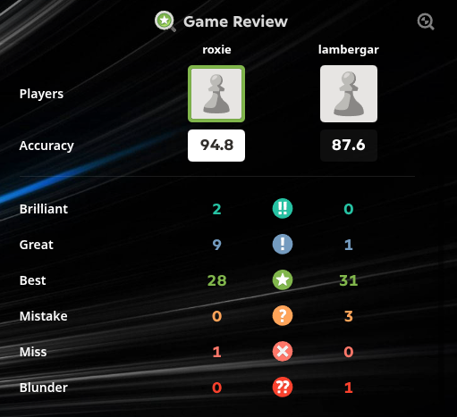

# ♜ Roxie

<p align="center">
A modern UCI chess engine written from scratch in <b>Rust</b>.<br>
Currently playing at <b>3000+ Elo</b>, with the long-term goal of reaching <b>3500 Elo</b>.
</p>

---

## About

**Roxie** is a hobby chess engine developed entirely from scratch in **Rust**, focusing on strong search, efficient evaluation, and modern engine design.

What started as a personal learning project has gradually evolved into a competitive chess engine through continuous experimentation, profiling, tuning, and thousands of self-play and engine-vs-engine games.

Today, Roxie has surpassed the **3000 Elo** milestone and continues to improve with every iteration.

---

## Highlights

- ♟️ UCI compatible
- ⚡ Written entirely in Rust
- 🧠 Quantized HalfKP NNUE evaluation
- 🚀 Magic Bitboard move generation
- 🔍 Modern alpha-beta search with advanced pruning and move ordering
- 📈 Continuously tuned through thousands of self-play and engine matches
- 💻 Optimized builds for Native, AVX2 and AVX-512 processors

---

## Performance

Roxie is continuously tested against established engines using automated tournaments and self-play to measure playing strength and identify areas for improvement.

One example is the tactical victory shown below, where Roxie defeated **lambergar (~3500 Elo)** in a **10+0.1** rapid game.

<p align="center">
    
</p>

The full game can be found in [`assets/roxie_vs_lambergar.pgn`](assets/roxie_vs_lambergar.pgn).

---

## Features

### ♟️ Search

Roxie uses a modern alpha-beta search framework designed to search deeper while minimizing unnecessary work.

- Principal Variation Search (PVS)
- Iterative Deepening
- Aspiration Windows
- Quiescence Search
- Transposition Tables
- Advanced pruning and reduction techniques
- Efficient move ordering heuristics

### 🧠 Evaluation

- Quantized **HalfKP NNUE** evaluation
- Efficient neural inference for positional evaluation
- Classical evaluation terms blended with neural evaluation

### ⚡ Move Generation

- Magic Bitboards
- Optimized make/unmake move implementation
- Zobrist hashing for transposition and repetition detection

### 🚀 Performance

- Native CPU optimizations
- AVX2 and AVX-512 builds
- Profile Guided Optimization (PGO) support

---

## Building

### Requirements

- Rust (stable toolchain)
- Cargo
- GNU Make

Clone the repository and build Roxie using one of the following targets.

```bash
git clone https://github.com/sham-404/roxie.git
cd roxie
```

Build the binary using any one of the following
```bash
# Optimized for your current CPU
make native

# Optimized for AVX2 + BMI2 + POPCNT capable processors
make avx2

# Optimized for AVX-512 capable processors
make avx512

# Build using Profile-Guided Optimization
make pgo-avx512
```

To remove build artifacts:

```bash
make clean
```

---

## Usage

After building, the engine executable will be located at the current dir (name differes based on the build):

```text
./roxie*
```

### Running from the Terminal

Roxie speaks the **Universal Chess Interface (UCI)** protocol.

Start the engine with:

```bash
./roxie*
```

Example UCI session:

```text
uci
isready
ucinewgame
position startpos
go depth 12
```

or search a custom position:

```text
position startpos moves e2e4 e7e5 g1f3
go movetime 5000
```

### Using a Chess GUI

Roxie is compatible with any **UCI-compatible** chess GUI, including:

- Arena
- Cute Chess
- Banksia GUI
- Nibbler

Simply add the compiled `roxie` executable as a new UCI engine from your GUI's engine manager.

### Engine Matches

Roxie can also be used with tournament managers such as **cutechess-cli** for automated engine-vs-engine matches and self-play testing.

---

## Roadmap

Current focus:

- Improve NNUE playing strength through larger training datasets
- Continue search tuning and evaluation improvements
- Stronger endgame play
- Better time management
- Multi-threaded search (SMP)

Ultimate goal:

> Reach **3500 Elo** while remaining a clean, educational, and highly optimized open-source chess engine.

---

## Development

Roxie is under active development, with every improvement tracked through detailed version history and benchmarks.

For a complete record of engine evolution and newly added features, see:

- **CHANGELOG.md** *(development history)*
- **docs/nnue.md** *(NNUE architecture and implementation details)*

---

## License

This project is licensed under the **MIT License**.

See the [LICENSE](LICENSE) file for details.
